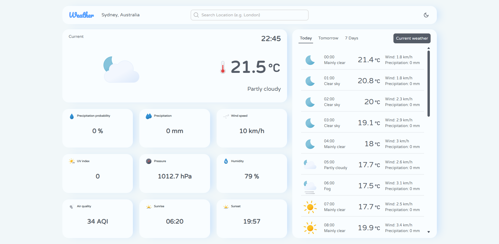

# Weather app
A weather application built with vanilla HTML, CSS, JavaScript and Webpack.



## Data & Assets
- **Weather Data:** [Open-Meteo API](https://open-meteo.com/)
- **Icons:** Animated SVG icons by [@basmilius](https://github.com/basmilius/weather-icons)

## Instalation
- Install dependencies:
   ```bash
   npm install
- Run dev server:
   ```bash
   npx webpack serve
- Bundle:
   ```bash
   npm webpack